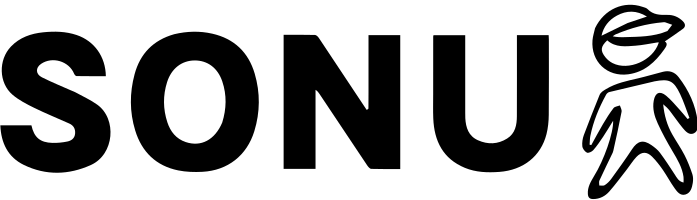

<div align="center">

<br />

<!-- Logo / Name Banner -->


<br />
<br />

# SK Sahinur Islam — Portfolio

### Full Stack Developer · IT Engineer · Cybersecurity Enthusiast

<br />

[](https://sksahinurislam.dev)
[](https://www.linkedin.com/in/sksahinurislam/)
[](https://github.com/GeniousSonu)
[](https://www.upwork.com/freelancers/~0104912246c7c7bdbf)

<br />

> **Engineered from scratch. No templates. No AI-generated code. Just raw skill and 100% handcrafted code.**

<br />


</div>

---

## 📌 About This Project

This **portfolio showcases** my professional journey, technical expertise, and selected projects across Information Technology, Network Engineering, and Web Development. Designed with a focus on clarity, performance, and user experience, it serves as a platform to highlight my skills, experience, certifications, and ongoing commitment to learning and innovation.

The goal of this website is to provide a comprehensive overview of my work while demonstrating modern web development practices and a strong attention to detail.
The design aesthetic draws from **dark terminal interfaces**, **cyberpunk developer culture**, and **premium SaaS product design** — blending them into something that feels both technical and polished.

---

## ✨ Features

- 🎬 **Custom Loader** — animated boot sequence with progress bar
- 🖱️ **Custom Cursor** — floating dot + ring that reacts to hover targets
- 🌐 **Interactive 3D Globe** — built with Globe.gl and Three.js, showing global connection arcs
- 🔤 **GSAP Hero Animations** — line-by-line text reveals with staggered easing
- 💻 **Terminal-style Typing Effect** — cycling bash commands using GSAP TextPlugin
- 📊 **Animated Stats Counters** — number animation with ScrollTrigger
- 🃏 **Project Cards** — hover effects, radial glow, stack chips, live links
- 🛡️ **Skills Bars** — animated progress fills triggered on scroll
- 🏅 **Certifications Grid** — 30+ real certs with provider brand logos
- 📬 **Contact Section** — functional form + SSH ping terminal block
- 🔗 **Linktree Hub** — social links with real SVG brand icons (no emoji)
- 💚 **Matrix Rain Footer** — canvas-based animated Japanese/hex character rain
- 🍔 **Animated Hamburger → X** — clip-path circle reveal mobile nav
- 📱 **Fully Responsive** — pixel-perfect across 320px phones to 27″ 4K monitors
- ⚡ **Zero External UI Frameworks** — 100% Vanilla CSS, custom design system
- 🎯 **SEO Optimised** — JSON-LD schema, OpenGraph, semantic HTML
- 🔒 **Patent Listed** — real pending patent included in projects section

---

## 🛠️ Tech Stack

| Layer           | Technology                                                       | Version | Purpose                                   |
| --------------- | ---------------------------------------------------------------- | ------- | ----------------------------------------- |
| **Framework**   | [Next.js](https://nextjs.org/)                                   | 16.2.9  | App routing, SSR, file structure          |
| **UI Library**  | [React](https://react.dev/)                                      | 19.2.4  | Component model, state, effects           |
| **Animation**   | [GSAP (GreenSock)](https://gsap.com/)                            | 3.15.0  | All motion — hero, scroll, text, counters |
| **3D Globe**    | [Globe.gl](https://globe.gl/)                                    | 2.46.1  | Interactive rotating globe with arcs      |
| **3D Engine**   | [Three.js](https://threejs.org/)                                 | 0.184.0 | WebGL renderer powering Globe.gl          |
| **Styling**     | Vanilla CSS                                                      | —       | Custom design system, all components      |
| **Fonts**       | [IBM Plex Mono](https://fonts.google.com/specimen/IBM+Plex+Mono) | —       | Terminal / mono elements                  |
| **Fonts**       | [General Sans](https://fontshare.com/fonts/general-sans)         | —       | Body and heading typography               |
| **Icons**       | Inline SVG                                                       | —       | All brand icons — zero dependencies       |
| **Matrix Rain** | Canvas API                                                       | Native  | Animated Japanese/hex character rain      |
| **Build**       | ESLint + Next Build                                              | —       | Linting and production bundling           |
| **Deploy**      | Vercel / Netlify                                                 | —       | Edge hosting                              |

---

## 📂 Project Structure

```
portfolio/
├── public/
│   └── logo.svg                # Custom SONU brand logo (transparent SVG)
├── src/
│   ├── app/
│   │   ├── globals.css          # Full custom design system (~1100 lines)
│   │   ├── layout.js            # Root layout, meta, JSON-LD schema
│   │   └── page.js              # Main page — composes all sections
│   └── components/
│       ├── Navbar.jsx           # Fixed nav + animated hamburger + mobile overlay
│       ├── Hero.jsx             # GSAP hero — name reveal, typing terminal, stats
│       ├── About.jsx            # About, sysinfo panel, patent card
│       ├── Experience.jsx       # Timeline with animated dots
│       ├── Projects.jsx         # Project cards with live/source links
│       ├── Skills.jsx           # Skill bars with scroll-triggered fill
│       ├── Certifications.jsx   # 16+ cert cards with provider logos
│       ├── GlobeConnect.jsx     # Globe.gl 3D globe with arcs
│       ├── Contact.jsx          # Contact form + social links + Linktree hub
│       ├── Footer.jsx           # Matrix rain canvas + 4-col footer grid
│       ├── Loader.jsx           # Boot-up loading screen
│       └── CustomCursor.jsx     # Custom cursor dot + ring
├── package.json
├── next.config.mjs
└── README.md
```

---

## 🚀 Getting Started

### Prerequisites

- Node.js **v18+**
- npm or yarn

### Installation

```bash
# 1. Clone the repository
git clone https://github.com/GeniousSonu/Portfolio.git
cd Portfolio

# 2. Install dependencies
npm install

# 3. Run the development server
npm run dev
```

Open [http://localhost:3000](http://localhost:3000) in your browser.

### Build for Production

```bash
npm run build
npm start
```

---

## 📸 Sections

| Section            | Description                                              |
| ------------------ | -------------------------------------------------------- |
| **Hero**           | Animated name reveal, role, description, stats, terminal |
| **About**          | Bio, system info panel, patent card                      |
| **Experience**     | Timeline with company, role, tech tags                   |
| **Projects**       | 6 projects with live demos and GitHub links              |
| **Globe**          | Interactive 3D globe showing global presence             |
| **Skills**         | Animated skill bars across 5 categories                  |
| **Certifications** | 16 of 30+ real certifications with provider logos        |
| **Contact**        | Email form, social links, Linktree hub                   |
| **Footer**         | Matrix rain background, multi-column links               |

---

## 🆓 Free to Use — With Credit

This portfolio is **open-source and free to use** as inspiration or a starting point for your own portfolio.

**Rules:**

1. ✅ You may use this as a reference or template
2. ✅ You may fork and modify it for your own portfolio
3. ⚠️ **You must give credit** — link back to this repo or mention my name
4. ❌ Do not claim this design as your original work
5. ❌ Do not resell or redistribute as a commercial template

**Credit line (add to your README or footer):**

```
Design inspired by SK Sahinur Islam — github.com/GeniousSonu/Portfolio
```

---

## 🙏 Credits & Acknowledgements

All technology used in this project is open-source and free. Grateful to the teams behind:

- **[Next.js](https://nextjs.org/)** by Vercel — for the best React framework
- **[GSAP](https://gsap.com/)** by GreenSock — for the most powerful animation library on the web
- **[Three.js](https://threejs.org/)** by mrdoob — for making WebGL accessible
- **[Globe.gl](https://globe.gl/)** by vasturiano — for the beautiful 3D globe component
- **[IBM Plex Mono](https://www.ibm.com/plex/)** by IBM — for the perfect monospace font
- **[General Sans](https://fontshare.com/fonts/general-sans)** by Indian Type Foundry / Fontshare — for the clean sans-serif
- **[React](https://react.dev/)** by Meta — for the UI model

---

## 👨‍💻 About Me

**SK Sahinur Islam** — Full Stack Developer & IT Engineer from Kolkata, India.

I build things that live on the web and run on servers. I'm passionate about clean code, great UX, Linux systems, cybersecurity, and building tools that actually solve problems.

| Platform     | Link                                                                                                 |
| ------------ | ---------------------------------------------------------------------------------------------------- |
| 🌐 Website   | [genioussonu.netlify.app](https://genioussonu.netlify.app/)                                                     |
| 💼 LinkedIn  | [linkedin.com/in/sksahinurislam](https://www.linkedin.com/in/sksahinurislam/)                        |
| 🐙 GitHub    | [github.com/GeniousSonu](https://github.com/GeniousSonu)                                             |
| 💚 Upwork    | [upwork.com/freelancers/~0104912246c7c7bdbf](https://www.upwork.com/freelancers/~0104912246c7c7bdbf) |
| 🌴 Linktree  | [linktr.ee/sksahinurislam](https://linktr.ee/sksahinurislam)                                         |
| 📸 Instagram | [@genious.exe](https://instagram.com/genious.exe)                                                    |

---

## 📄 License

```
MIT License

Copyright (c) 2025 SK Sahinur Islam

Permission is hereby granted, free of charge, to any person obtaining a copy
of this software, to use, copy, modify, and distribute it, subject to the
following conditions:

- Credit must be given to the original author (SK Sahinur Islam)
- This notice must be included in all copies or substantial portions

THE SOFTWARE IS PROVIDED "AS IS", WITHOUT WARRANTY OF ANY KIND.
```

---

<div align="center">

**Built with precision, deployed with intent.**

`sahinur@dev:~$` `echo "Thanks for visiting ✓"`

<br />

⭐ **If you found this useful, drop a star on the repo — it means a lot!**

</div>
